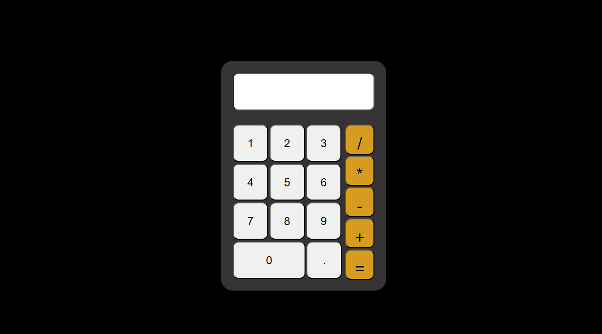

# 🧮 Calculadora em JavaScript



---

## 🛠️ Badges


---

## 📑 Índice

- [Descrição do projeto](#-descrição-do-projeto)
- [Funcionalidades](#-funcionalidades)
- [Como os usuários podem utilizá-lo](#-como-os-usuários-podem-utilizá-lo)
- [Onde encontrar ajuda](#-onde-os-usuários-podem-encontrar-ajuda-sobre-o-projeto)
- [Autores](#-autores-do-projeto)
- [Licença](#-licença)

---

## 📘 Descrição do projeto

### Introdução

Este projeto consiste no desenvolvimento de uma **calculadora funcional utilizando apenas HTML, CSS puro e JavaScript**, sem o uso de frameworks ou IAs.

O principal objetivo é **me desafiar a escrever todo o código por conta própria**, sem recorrer a ferramentas de Inteligência Artificial, reforçando a lógica de programação, manipulação do DOM e organização de código.

### Status do projeto

🚧 **Em desenvolvimento**

### Link de exibição

🔗 [Acesse a calculadora online](https://seu-link-aqui.vercel.app)

---

## ⚙️ Funcionalidades

### 1️⃣ Interface da Calculadora
- Exibe um visor para números e operações
- Botões organizados de forma intuitiva
- Layout responsivo utilizando CSS puro


---

### 2️⃣ Operações Matemáticas Básicas
- Soma
- Subtração
- Multiplicação
- Divisão

A lógica é feita inteiramente em **JavaScript**, manipulando eventos de clique e atualizando o visor dinamicamente.


---

### Dependências de instalação

❌ Nenhuma dependência externa  
O projeto utiliza apenas:
- HTML
- CSS
- JavaScript

---

### Versão das linguagens

- **HTML5**
- **CSS3**
- **JavaScript ES6+**

---

## 🚀 Como os usuários podem utilizá-lo

### Instalação local

1. Clone este repositório:
   ```bash
   git clone https://github.com/seu-usuario/calculadora-js.git
  ´´´
Depois, acesse o index.html do projeto:

##👩‍💻 Autor do projeto

**Galves-gi**
